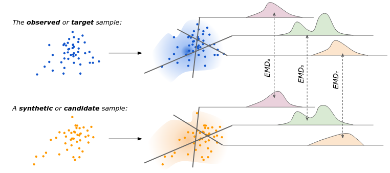

# Acteval

[](https://github.com/fredshone/acteval/actions/workflows/ci.yml)
[](https://pypi.org/project/acteval/)
[](https://pypi.org/project/acteval/)
[](https://github.com/fredshone/acteval/blob/main/LICENSE)
[](https://fredshone.github.io/acteval/dev/bench/)
[](https://github.com/astral-sh/ruff)
[](https://github.com/psf/black)
[](https://github.com/astral-sh/uv)

**Act**ivity schedule **eval**uation. A density estimation framework, and supplementary metrics, for comprehensively comparing or evaluating samples of activity schedules and associated attributes. CLI and python API.

**Why Acteval?**

- **Agnostic** - Acteval provides a thorough evaluation framework agnostic of downstream application.
- **Explainable** - High-level quantitative evaluation is composed of a hierarchy of interpretable metrics.

> **Work in progress.** Acteval has been in use since 2024, and included in various publications. But is still under active development. We therefore do not commit to backward compatibility of outputs until version 1 is released.

Skip to:
- [About](#about)
- [Quick Start](#quick-start)
- [Data Formats](#data-formats)
- [API](#api)
- [CLI](#cli)
- [Development](#development)
- [Benchmarks](#benchmarks)

## Install

```bash
pip install acteval  # or uv pip install...
```

Or for your own python project (I recommend using [uv](https://github.com/astral-sh/uv)):

```bash
uv add acteval
```

## About

### Density estimation

Activity schedules are complex, high-dimensional, sequences of activity participations and times. Comparing the (probability) densities of high dimensional data samples is hard. Acteval tackles density estimation through comprehensive *slicing*. An example of a single *slice* might be a histogram of trips rates. The histograms of trips rates, between an **observed** or target sample, can be compared to a candidate or **synthetic** sample using earth movers distance (EMD) such that lower distances show a closer match.

To give a comprehensive estimation of density numerous slices are considered, for example:

- The participation rates of shop activities
- The transition rates of changing from home to work activities
- The start times of education activities.



### Domains

The default [configuration](https://github.com/fredshone/acteval/blob/main/src/acteval/config.toml) of Acteval disaggregates slices by activity types and includes joint distributions such as start times and durations of an activity type. This results in *a lot* of slices. For convenience, these are aggregated (using weighted averages) into top-level **domain** metrics and mid-level **group** metrics, as follows: 

- **Participations** *- do activities take place the correct number of times?*:
    - **Trip rates** *- are sequences the correct length?*
    - **Activity rates** *- how often do people go to e.g. work?*
    - **Joint activity rates** *- how often do people go to e.g. work and shop?*
- **Transitions** *- do activities take place in the correct order?*:
    - **Activity 2-grams** *- how often do people transition from e.g. work to shop?*
    - **Activity 3-grams** *- how often do people transition from e.g. home to work to home?*
    - **Activity 4-grams** *- how often do people transition from e.g. home to shop to work to home?*
- **Timings** *- do activities take place at the correct times and for the correct durations?*:
    - **Activity start times** *- when do people start e.g. work?*
    - **Activity durations** *- how long do people e.g. shop?*
    - **Activity joint start times and durations** *- when do people start and how long do they e.g. work?*
    - **Activity 2-gram durations** *- how long do people e.g. shop and work?*

### Joint attributes-schedules density estimation

The above metrics consider the density estimates of samples of activity schedules. These can be further sliced based on associated attributes or labels so that the joint distribution of samples and schedules with associated attributes, such as *the income of the person undertaking the schedule*, or *the day of the week the schedule took place on*, can be considered.

This is achieved by additionally supplying **observed** and **synthetic** attributes that can be joined to their corresponding schedules using unique `pid` identifiers. As with the regular density estimations, category-level distances are typically aggregated to attribute-level and then domain-level.


### Supplementary metrics

We also supplement these density estimation distances with creativity and feasibility metrics for the synthetic sample as follows:

- **Creativity** *- is my model realistically diverse and does it avoid memorisation?*:
    - **Diversity** *- are generated samples unique from each other?*
    - **Novelty** *- are generated samples unique from the observed samples?*
- **Feasibility** *- does my model avoid structural zeros i.e. unrealistic schedules?*:
    - **Home-based** *- do samples start and end at home?*
    - **Sequences** *- do samples include consecutive work, education or home activities?*

In all cases we calculate probabilities and report the complementary, so that smaller is better. Note that the feasibility metrics are highly opinionated and may not suit all use cases.


## Quick start

There is both a command line interface and python interface:

### CLI in brief

Once installed, run the following on your command line, for example using `uv run` or install as an executable using `uv tool install acteval`.

```bash
# Compare one model to observed activity schedules
acteval compare observed.csv -m my_model synthetic.csv

# Compare multiple models side-by-side
acteval compare observed.csv -m model_a synthetic_a.csv -m model_b synthetic_b.csv

# Save results to a specific output dir (the default is ./results/)
acteval compare observed.csv -m my_model synthetic.csv -o my_results/

# Split evaluation by attributes (e.g. gender and age)
acteval compare observed.csv --target-attrs target_attrs.csv \
  -m model_a synthetic_a.csv synth_attrs_a.csv \
  -m model_b synthetic_b.csv synth_attrs_b.csv \
  --split-on gender age
```

Explore the CLI further using `acteval --help` or refer to more details [below](#api), such as batch mode. 

### Python API in brief

```python
import pandas as pd
from acteval import compare

observed = pd.DataFrame([
    {"pid": 0, "act": "home", "start": 0,  "end": 8},
    {"pid": 0, "act": "work", "start": 8,  "end": 16},
    {"pid": 0, "act": "home", "start": 16, "end": 24},
    {"pid": 1, "act": "home", "start": 0,  "end": 12},
    {"pid": 1, "act": "shop", "start": 12, "end": 13},
    {"pid": 1, "act": "home", "start": 13, "end": 24},
])

synthetic = pd.DataFrame([
    {"pid": 0, "act": "home", "start": 0,  "end": 9},
    {"pid": 0, "act": "work", "start": 9,  "end": 17},
    {"pid": 0, "act": "home", "start": 17, "end": 24},
    {"pid": 1, "act": "home", "start": 0,  "end": 8},
    {"pid": 1, "act": "work", "start": 8,  "end": 16},
    {"pid": 1, "act": "home", "start": 16, "end": 24},
    {"pid": 2, "act": "home", "start": 0,  "end": 8},
    {"pid": 2, "act": "home", "start": 8, "end": 24},
])

result = compare(observed, synthetic)
print(result.summary())
#                 synthetic
# domain
# creativity      0.166667
# feasibility     0.333333
# participations  0.162037
# timing          0.082728
# transitions     0.380952
```

The `compare()` function also supports **batch** comparisons using `{name: DataFrame}` dict to compare several samples:

```python
result = compare(
    observed,
    {
        "model_a": synthetic_a,
        "model_b": synthetic_b
    },
)

```

The `compare()` function also supports **joint** attribute-schedule comparisons:

```python
result = compare(
    target_schedules: observed,
    target_attributes=target_attrs,
    synthetic_schedules: synthetic,
    synthetic_attributes=synthetic_attributes,
    split_on=["gender", "weather"],
)

```

...and **batching** of **joint** attribute-schedule comparisons:

```python
result = compare(
    target_schedules: observed,
    target_attributes=target_attrs,
    synthetic_schedules: {
        "model_a": synthetic_a,
        "model_b": synthetic_b
    },
    synthetic_attributes={
        "model_a": attributes_a,
        "model_b": attributes_b
    },
    split_on=["gender", "weather"],
)

```

`result` is an `EvalResult`. See [Reading the results](#reading-the-results) for more detail.

## Data formats

Data is passed as a pandas (or [polars](https://pola.rs)) DataFrames with the API. The CLI will accept both .csv and .parquet.

### Activity schedules

A DataFrame with one row per activity:

| column | type | description |
|--------|------|-------------|
| `pid` | int/str | Person identifier |
| `act` | str | Activity label (e.g. `"home"`, `"work"`, `"shop"`) |
| `start` | numeric | Start time (any consistent unit, e.g. hours) |
| `end` | numeric | End time |
| `duration` | numeric | Duration (`end - start`) |

Any two of `start`, `end`, and `duration` are sufficient — the third is derived automatically. A polars DataFrame in the same shape works anywhere a pandas one does; it's converted internally.

### Attributes

Attributes can be as a pandas (or polars) DataFrame with one row per activity schedule. These should be joinable using a `pid` column. Attributes themselves can be arbitrarily named and used, though we suggest restricting yourself string column names and to categorical variables. 

## API

### Comparing populations

#### `compare(target_schedules, synthetic_schedules: DataFrame, **kwargs)`

```python
result = compare(observed, synthetic)
```
`result` is an `EvalResult` object. See [Reading the results](#reading-the-results) for how to access distances and descriptions at feature, group, and domain level.

#### `compare(target_schedules, synthetic_schedules: dict[str, DataFrame], **kwargs)`

Name a synthetic sample, or provide multiple named samples using a dict:

```python
result = compare(observed, {"model_a": synthetic_a, "model_b": synthetic_b})
```

#### `compare(target_schedules, synthetic_schedules, target_attributes: DataFrame, synthetic_attributes: dict[str, DataFrame], split_on: list[str], **kwargs)`

Pass `target_attributes` and `synthetic_attributes` and `split_on` to evaluate separately within each category of an attribute (e.g. gender) instead of over the whole population:

```python
target_attrs = pd.DataFrame({
    "pid": [0, 1],
    "gender": ["M", "F"]
})
synthetic_attributes = pd.DataFrame({
    "pid": [0, 1],
    "gender": ["F", "M"]
})

result = compare(
    target_schedules=observed,  # <- target or observed activity schedules
    synthetic_schedules={"my_model": synthetic},  # <- dict of synthetic activity schedules
    target_attributes=target_attrs,  # <- target or observed attributes
    synthetic_attributes={"my_model": synthetic_attributes},  # <- dict of synthetic attributes
    split_on=["gender"],
)
```

This makes the `by_attribute`/`by_category` splits available at every level via `result.at(level, split)` — see [Reading the results](#reading-the-results) for how to read them.

> **Numeric split columns are auto-binned.** If a `split_on` column is numeric
> (float, or an integer with more than 10 unique values), it's automatically
> bucketed into up to 5 ordinal bins (`"lowest"`...`"highest"`) via `pd.qcut`,
> with a `UserWarning` noting the bin edges chosen. Encode the column as a
> categorical/string beforehand (e.g. your own age bands) to control the
> buckets yourself and suppress the warning.


#### `Evaluator`

`compare` is a wrapper for `Evaluator` — it computes and caches the observed features as required.

```python
from acteval import Evaluator

evaluator = Evaluator(observed)

result_v1 = evaluator.compare({"v1": synthetic_v1})
result_v2 = evaluator.compare({"v2": synthetic_v2})
```

#### `**kwargs`

Pass `progress=True` to either `compare()` or `Evaluator(...)` to show tqdm progress bars.

Pass `disable` with a list of dotted `section.key` paths matching `config.toml` to switch off individual metrics without writing a custom config file:

```python
result = compare(
    ...
    disable=["jobs.creativity.novelty", "jobs.transitions.4-gram"],
)
```

Call `list_disable_keys()` to see every valid dotted path up front, instead of
reading `config.toml` or triggering the `ValueError` an unknown key raises (which
also lists the valid paths). `disable` also works on `Evaluator(observed,
disable=[...])` and the CLI's `--disable` flag.

For anything more involved than a metric or two, pass your own configuration file
rather than using the [default](https://github.com/fredshone/acteval/blob/main/src/acteval/config.toml),
e.g. `compare(observed, synthetic, config_path=PATH)` (also accepted by
`compare_grid()`, `compare_many()`, `Evaluator(...)` and the CLI's `--config`).
`disable` is applied on top of whatever `config_path` loads. `Evaluator` also
accepts a pre-built `jobs` (`EvalConfig`), which cannot be combined with
`config_path` or `disable`.

#### `compare_grid()` — every target × every model

To compare the *same* synthetic models against several targets (e.g. several
observed populations) and see them side-by-side, use `compare_grid()`:

```python
from acteval import compare_grid

result = compare_grid(
    {"target_a": observed_a, "target_b": observed_b},
    {"model_1": synthetic_1, "model_2": synthetic_2},
)
```

##### `compare_many()` — targets and models paired one-to-one

To compare each target against just its corresponding synthetic model — e.g.
model 1 was fit against target A, model 2 against target B, and you want each
scored only against its own target — use `compare_many()`. The two dicts are
paired up positionally (first with first, second with second, ...) and must be
the same length:

```python
from acteval import compare_many

result = compare_many(
    {"target_a": observed_a, "target_b": observed_b},
    {"model_a": synthetic_a, "model_b": synthetic_b},
)

print(result.model_names)
# ['target_a::model_a', 'target_b::model_b']
```

Both helpers accept `attributes_a`/`attributes_b` (per-target/per-model
attributes DataFrames) and `split_on`, and pass any other keyword arguments
(e.g. `config_path`, `disable`, `progress`) through to `compare()`.

For per-target attributes/`split_on` with more control, or to inspect
intermediate per-target results before merging, call `compare()` yourself in a
loop and pass the results to `acteval.results.combine()`:

```python
from acteval.results import combine

results = {
    "target_a": compare(observed_a, synthetic),
    "target_b": compare(observed_b, synthetic),
}
result = combine(results)
```

> **Known limitation:** the shared `target`/`unit` values underlying feature →
> group → domain aggregation are taken from the *first* result only, so
> re-aggregating a non-first target's columns uses that first target's weights
> rather than its own. Each model's distances are still computed against its own
> target — this only affects aggregation weighting, and will be resolved by a
> future refactor to carry one weight base per source.


#### `pairwise_distances(schedules, specs=None)`

> **Work in progress only!**

Compute a single NxN distance matrix between individual schedules. Useful for clustering, outlier detection, or directly comparing a small batch of schedules — a standalone code path, independent of `compare()`/`Evaluator`/`config.toml`.

```python
from acteval import pairwise_distances

result = pairwise_distances(schedules)
result.matrix          # numpy array, shape (N, N)
result.pids            # original pid values, length N
df = result.to_dataframe()  # labeled DataFrame, original pid values as index/columns
```

The result matrix is symmetric with zeros on the diagonal. All values are in **0–1**.

By default, three equal-weight semantic-distance specs are used (participations,
transitions, timing via MAE). Pass a custom `specs` list to change the metrics or
their relative weights, e.g. `pairwise_distances(schedules, specs=[chamfer_spec()])`.
Each spec defines a `feature_fn` (extracts a `(N, ...)` array from the population)
and a `distance_fn` (computes the `(N, N)` matrix); the final matrix is a weighted
average across all active specs. See `acteval.pairwise` for the available factories —
`default_pairwise_specs()`, `chamfer_spec(max_len, weight)`, `soft_dtw_spec(max_len, gamma, weight)`.

`Population` is the internal numpy-precomputation layer `compare()`/`pairwise_distances()` are built on — most users never construct it directly; see its docstring (`acteval.population.Population`) if you need it.

#### `acteval.plot`

Matplotlib plotting helpers for interactive/notebook use — Gantt charts, time-use
and participation-rate breakdowns, bigram heatmaps, start/end/duration histogram
grids, sequence-probability waterfalls, and heatmap/bar-chart views of a
`compare()` result. Not imported by `compare()`/`Evaluator`/`pairwise_distances`,
so it never runs unless you call into it. Submodules: `frequency`, `times`,
`transitions`, `plot` (schedule-level charts), `results` (result-level charts) —
see each module's docstring for the full function list.

```python
from acteval.plot.plot import gantt

gantt(observed)
```

## Reading the results

#### `EvalResult`

`compare` and `Evaluator` return large amounts of metrics. These are exposed via an `EvalResult` object, which you can use, for example, to extract quick domain summaries with `summary`:

#### `EvalResult.summary()`

For comparing models against each other, `summary()` is usually all you need:

```python
# Domain-level summary table
print(result.summary())
#                   model_a   model_b
# domain
# creativity       0.166667  0.333333
# feasibility      0.333333  1.000000
# participations   0.162037  0.988889
# timing           0.082728  0.669676
# transitions      0.380952  0.500000


```

> **Known limitation:** The density estimation domain distances and supplementary metrics have different units, supports and typical values.
We generally therefore do not aggregate them further into a "meta score". However you can access `rank_models()` and `best_model()` which do simply sum metrics to allow meta comparison. Use with care. For safer comparison we suggest normalisinng metrics against a baseline, for example, to report % improvement my each metric.

#### `EvalResult.save()`

Save all (low-level features, via groups to top-level domains) to CSV with `result.save("output_dir/")`.

#### `EvalResult.at(level, split)`

For anything more detailed than the summary table — a specific aggregation level, or a specific split — `result.at(...)`:

```python
result.at()                              # domains × combined (result.at().distances == result.summary())
result.at("groups")                      # groups × combined
result.at("features", "by_attribute")    # features × by_attribute (requires split_on)
result.at("domains", "by_category")      # domains × by_category   (requires split_on)
```

- `level` is one of `"features"`, `"groups"`, `"domains"`
- `split` is one of `"combined"`, `"by_attribute"`, `"by_category"` 

Each call returns an `AggregatedResult` with `.distances` and `.descriptions` DataFrames.

#### `EvalResult.raw`

`EvalResult.raw` exposes the pre-aggregation data (one `ResultFrame` each for descriptions and distances) that every level above is aggregated from — `distances` covers models only (there's no such thing as the target's distance to itself); pair it with `result.target_distance_weights` if you're building custom distance aggregations of your own.

> **Note on timing features:** A distance of `1.0` for a timing feature means the activity is *entirely absent* from the synthetic population — not just timed differently. This is treated as a maximum-penalty missing feature rather than a distributional difference.


## CLI

`acteval` ships with a command-line interface for comparing models without writing
Python. It has two subcommands: `compare` (the primary one) and `filter`.

#### `acteval compare`


```bash
# Compare one model to observed data
acteval compare observed.csv -m my_model synthetic.csv

# Compare multiple models side-by-side
acteval compare observed.csv -m model_a synthetic_a.csv -m model_b synthetic_b.csv

# Save results to CSV files
acteval compare observed.csv -m my_model synthetic.csv -o results/

# Show group-level detail instead of domain summary
acteval compare observed.csv -m my_model synthetic.csv -l groups

# Use a custom config file
acteval compare observed.csv -m my_model synthetic.csv -c custom.toml

# Disable specific metrics without a custom config file
acteval compare observed.csv -m my_model synthetic.csv --disable jobs.creativity.novelty
```

Input files can be CSV or Parquet (detected by extension). Run `acteval compare --help` for the full option list.

As per the API it is also possible to do joint density estimation by providing attributes:

```bash
# Split evaluation by attribute (e.g. gender and age)
# Per-model attrs are the third argument to -m
# Attributes must be provided for the target and ALL models, or not at all
acteval compare observed.csv --target-attrs target_attrs.csv \
  -m model_a synthetic_a.csv synth_attrs_a.csv \
  -m model_b synthetic_b.csv synth_attrs_b.csv \
  -s gender age
```

**Attribute rules:**
- Attributes must be provided for **all** inputs (target + every model) or **none**. Partial specification raises an error.
- `--split-on` (`-s`) and `--target-attrs` must be specified together.
- In batch mode, if any model subdirectory contains an attributes file, all subdirectories must contain one.

For the lazy - there is also an auto-discovery mode for batch experiments, but use with care:

```bash
# Batch mode: auto-discover model subdirectories
# Each subdir becomes a model (name = dir name); schedule and attrs files are
# classified by their columns (pid + act → schedule; pid + other cols → attrs)
acteval compare observed.csv --batch models/

# Batch mode with attribute splitting
acteval compare observed.csv --target-attrs target_attrs.csv --batch models/ --split-on gender
```


**Batch directory layout:**
```
models/
  model_a/
    schedules.csv      ← has pid, act → classified as schedule
    attributes.csv     ← has pid + other cols, no act → classified as attrs
  model_b/
    ...
```

#### `acteval filter`

Filter a schedule file down to persons with a specific structural issue — useful for
spot-checking a synthetic population before running `compare`.

```bash
# Schedules that don't start and end at home
acteval filter non-home-based synthetic.csv -o flagged.csv

# Schedules with consecutive duplicate activities (default: home, work, education)
acteval filter consecutive synthetic.csv --act home shop
```

Without `-o/--output`, filtered rows are printed to stdout as CSV. Run
`acteval filter --help` for the full option list.

## Development

```bash
# Install dependencies (including dev tools)
uv sync

# Run tests (benchmarks excluded by default)
uv run pytest tests/

# Run tests with coverage
uv run pytest --cov=src/acteval tests/

# Lint with ruff
ruff check src/ tests/

# Auto-fix lint issues
ruff check --fix src/ tests/

# Check formatting with black
black --check src/ tests/

# Auto-format
black src/ tests/
```

## Benchmarks

Two benchmark suites are included, both using [pytest-benchmark](https://pytest-benchmark.readthedocs.io/).

### Population evaluation (`compare`)

Tests `compare()` at 1k, 20k, and 100k rows (observed + synthetic populations):

```bash
uv run pytest tests/test_bench_evaluate.py --benchmark-only -v
```

### Pairwise distances (`pairwise_distances`)

Tests `pairwise_distances()` at 256, 512, and 1024 schedules:

```bash
uv run pytest tests/test_bench_pairwise.py --benchmark-only -v
```

### Both suites together

```bash
uv run pytest tests/test_bench_evaluate.py tests/test_bench_pairwise.py --benchmark-only -v
```

### Comparing runs

```bash
# Save a baseline
uv run pytest tests/test_bench_evaluate.py tests/test_bench_pairwise.py --benchmark-only --benchmark-save=baseline

# Compare against it after making changes
uv run pytest tests/test_bench_evaluate.py tests/test_bench_pairwise.py --benchmark-only --benchmark-compare=baseline
```
